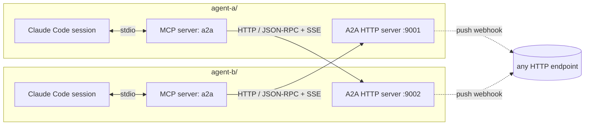
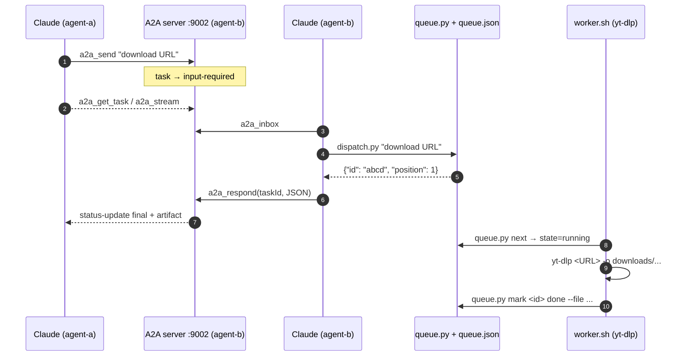

# claude-a2a — two Claude Code agents talking over Google's A2A protocol

Two real Claude Code instances in subfolders (`agent-a/`, `agent-b/`) collaborate using a minimal-but-faithful implementation of [Google's Agent2Agent (A2A) protocol](https://github.com/google/A2A). The protocol is exposed to each Claude session as MCP tools, so the agents discover each other, send messages, stream events, and register push notifications without any custom application code on top.

## Highlights

- **Dual-stack per agent**: an A2A HTTP server (FastAPI + JSON-RPC 2.0) + an MCP stdio bridge that wraps both the peer and the local server as tools.
- **Full A2A surface**: Agent Card discovery, `message/send`, `message/stream` (SSE), `tasks/get`, `tasks/cancel`, `tasks/resubscribe`, `tasks/pushNotificationConfig/{set,get}`, `tasks/respond` and `tasks/inbox` helpers.
- **Test suite**: 36 pytest tests covering protocol, streaming, push delivery, queue concurrency, dispatcher, and worker behavior (mock yt-dlp).
- **Flagship use case**: `agent-a` enqueues video downloads on `agent-b`, a yt-dlp expert with a serial JSON-backed queue. Run end-to-end with one shell command.

## High-level flow



Each MCP bridge talks to two A2A endpoints: the **peer** (for `send`, `stream`, `cancel`, `set_push_config`, …) and the **local** server (for `inbox` and `respond`).

## yt-dlp use-case sequence



## Layout

```
a2a/
├── shared/                A2A protocol + MCP bridge (importable lib)
│   ├── a2a.py
│   └── mcp_bridge.py
├── agent-a/               role: requester
│   ├── server.py          A2A HTTP on :9001
│   ├── .mcp.json          registers MCP bridge for Claude Code
│   └── CLAUDE.md
├── agent-b/               role: yt-dlp expert
│   ├── server.py          A2A HTTP on :9002
│   ├── .mcp.json
│   ├── CLAUDE.md
│   ├── dispatch.py        single entry: parse + run + envelope
│   ├── queue.py           flock-protected JSON FIFO
│   └── worker.sh          serial yt-dlp daemon
├── demo/
│   ├── run.sh             end-to-end download demo
│   ├── run-stream.sh      same flow but using SSE (a2a_stream)
│   ├── run-push.sh        webhook-driven flow
│   └── push_receiver.py   tiny FastAPI capture server
├── tests/                 36 pytest tests
├── smoke.py               protocol smoke check
├── Makefile               up / down / smoke / test / demo / worker-up …
└── pyproject.toml         uv-managed; commitizen with pep621 version source
```

## Running

```bash
uv sync           # install (Python 3.11+; uv required)
make up           # boot both A2A HTTP servers
make smoke        # protocol-level smoke test (no Claude needed)
make test         # full pytest suite (36 tests)
make demo         # flagship demo: real Claude × 2, real yt-dlp
make demo-mock    # same demo with mock yt-dlp (no network)
make demo-stream  # showcase SSE streaming (a2a_stream)
make demo-push    # showcase push notifications + webhook receiver
make down         # stop everything
```

Two interactive Claude sessions:
```bash
cd agent-a && claude   # terminal 1
cd agent-b && claude   # terminal 2
```
Each session auto-loads its `a2a` MCP server via `.mcp.json`.

## Protocol coverage

| Feature | Method(s) | Status |
|---|---|---|
| Agent Card discovery | `GET /.well-known/agent-card.json` | ✅ |
| Task creation | `message/send` | ✅ |
| Polling | `tasks/get` | ✅ |
| Cancel | `tasks/cancel` | ✅ |
| Streaming | `message/stream`, `tasks/resubscribe` (SSE) | ✅ |
| Push notifications | `tasks/pushNotificationConfig/{set,get}` | ✅ (async webhook + token header) |
| Inbox / respond helpers | `tasks/inbox`, `tasks/respond` | ✅ (non-standard, kept for the human-in-the-loop demo case) |
| Auth on `/` | — | ❌ (loopback only) |
| File / data parts | — | ❌ (text only) |

## yt-dlp use case in one paragraph

`agent-a` is a thin requester. It speaks plain text over A2A: `download <url>`, `download <url> format <fmt>`, `status [<id>]`, `cancel <id>`. `agent-b` runs `dispatch.py` against each inbox message, which parses the command, calls `queue.py` (a flock-protected JSON FIFO), and responds with a `{command, ok, result, error}` envelope. A separate `worker.sh` daemon pulls jobs in FIFO order and shells out to `yt-dlp`. Demo orchestration lives under `demo/` and uses `claude -p --permission-mode bypassPermissions` to drive both sessions headlessly. See [demo/README.md](demo/README.md) for the full walkthrough.

## Tooling

- Python ≥ 3.11, managed with `uv`
- Versioning via [Commitizen](https://commitizen-tools.github.io/commitizen/) (`pep621` provider — single source of truth in `[project].version`)
- Conventional Commits + automatic CHANGELOG
