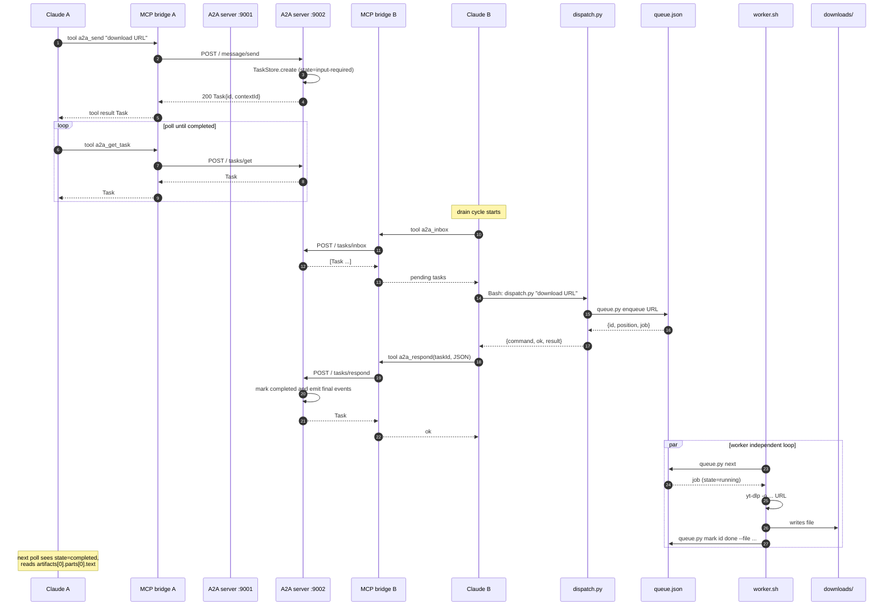

# yt-dlp demo — two Claude Code agents over A2A

This folder shows two **real Claude Code sessions** collaborating through Google's A2A protocol on a concrete job: downloading videos.

## The use case in one sentence

`agent-a` is a thin requester. It tells `agent-b` (a yt-dlp expert) "download this URL", "what is the queue status?", or "cancel this job", and prints back what `agent-b` says.

## Who does what

| Agent | Role | What it actually does |
|---|---|---|
| **agent-a** | requester | Sends plain-text commands to the peer via the A2A MCP tool `a2a_send`. Polls / streams / waits for the reply. Prints results. |
| **agent-b** | yt-dlp expert | Drains its A2A inbox. For each task, runs `python3 dispatch.py "<text>"` via Bash. Replies to the peer with the JSON envelope. Owns a serial download queue. |

Neither agent runs `yt-dlp` itself. A separate `worker.sh` daemon does the downloads.

## What's running while a demo executes

Five long-lived processes plus two short-lived `claude -p` sessions:

```
┌─────────────────────────────┐         ┌─────────────────────────────┐
│  Claude Code session A      │         │  Claude Code session B      │
│  (cwd: agent-a/)            │         │  (cwd: agent-b/)            │
│  ─ uses a2a MCP tools       │         │  ─ uses a2a MCP tools       │
│  ─ uses Bash (rare)         │         │  ─ uses Bash (dispatch.py)  │
└──────────────┬──────────────┘         └──────────────┬──────────────┘
               │ stdio                                 │ stdio
        ┌──────▼──────┐                         ┌──────▼──────┐
        │  MCP bridge │                         │  MCP bridge │
        │  (a2a)      │                         │  (a2a)      │
        └──┬───────┬──┘                         └──┬───────┬──┘
           │       │ HTTP/JSON-RPC + SSE           │       │
           │       └───────────────────────────────┼───────┐│
           │                                       │       ││
        ┌──▼──────────────┐                ┌───────▼───────▼┐│
        │ A2A server :9001│                │ A2A server :9002││
        │ (agent-a)       │                │ (agent-b)       ││
        └─────────────────┘                └────┬────────────┘│
                                                │             │
                                          inbox │             │
                                          via   │             │
                                          MCP   │             │
                                                ▼             │
                                       (Claude B reads inbox) │
                                                              │
                                       Bash: python3 dispatch.py
                                              │
                                              ▼
                                     ┌──────────────────┐
                                     │ queue.json       │  flock-protected
                                     └────────┬─────────┘  JSON FIFO
                                              │
                                              ▼
                                     ┌──────────────────┐
                                     │ worker.sh        │  serial
                                     │ (yt-dlp loop)    │  daemon
                                     └────────┬─────────┘
                                              ▼
                                     ┌──────────────────┐
                                     │ downloads/       │
                                     └──────────────────┘
```

The MCP bridge is the same code (`shared/mcp_bridge.py`) for both agents; it talks to two A2A endpoints — the **peer** (for `send`, `stream`, `set_push_config`, …) and **local** (for `inbox`, `respond`).

## The 7 steps a `download` request goes through

1. Claude A calls `a2a_send` text=`"download <url>"`.
2. MCP bridge of A POSTs JSON-RPC `message/send` to A2A server :9002.
3. Server B's `TaskStore` creates a task in state `input-required` and returns its id.
4. Claude B (next time it's invoked) calls `a2a_inbox`, sees the task, runs `python3 dispatch.py "download <url>"` via the Bash tool.
5. `dispatch.py` parses → calls `queue.py enqueue <url>` → prints `{command, ok, result, error}`.
6. Claude B calls `a2a_respond` with that JSON. Task moves to `completed`.
7. Meanwhile, `worker.sh` is in its own loop: `queue.py next` → `yt-dlp …` → `queue.py mark <id> done`.

Steps 1–6 are pure A2A. Step 7 is independent work the queue owner does on its own clock.

### Flow diagram (single download request)



The same flow works for `status` and `cancel` — only the `dispatch.py` branch + `queue.py` subcommand change. The `a2a_stream` showcase replaces the polling loop with a single SSE subscription that yields `task` → `artifact-update` → `status-update[final]`. The `push` showcase keeps polling but additionally fans every state change out to a registered webhook.

## The three demos

Each script boots A2A servers, the worker, and runs both Claude sessions headless via `claude -p --permission-mode bypassPermissions`. They differ only in how `agent-a` reads results back.

### 1. `run.sh` — poll-based (canonical flow)

```bash
./demo/run.sh                                    # default sample URLs
./demo/run.sh https://samplelib.com/lib/preview/mp4/sample-5s.mp4
./demo/run.sh --mock-ytdlp                       # no network, fake yt-dlp
./demo/run.sh --rounds 10 URL1 URL2 URL3
```

What you'll see, in order:
- `[demo] resetting state`
- `[demo] starting A2A HTTP servers`
- `[demo] starting yt-dlp worker (mock=…)`
- `[demo] starting agent-a session in background`
- `[demo] looping agent-b drainer (max N cycles)` followed by `drain cycle 1/N`, `drain cycle 2/N`, …
- `[demo] FINAL queue state` — JSON dump
- `[demo] downloads on disk` — `ls -la agent-b/downloads/`
- `[demo] tearing down`

Success looks like every job in the FINAL dump has `"state": "done"` and a real file under `agent-b/downloads/`.

### 2. `run-stream.sh` — SSE streaming

Same use case, but `agent-a` calls **`a2a_stream`** instead of `a2a_send` + `a2a_get_task` polling. The stream yields three event kinds in order:
- `task` — the initial submitted state
- `artifact-update` — the dispatch envelope from `agent-b`
- `status-update` with `final: true, state: "completed"`

```bash
./demo/run-stream.sh                             # uses mock yt-dlp + sample URL
./demo/run-stream.sh https://example.com/x.mp4
```

At the end the script greps the captured events out of agent-a's transcript so you can see what landed.

### 3. `run-push.sh` — webhook push notifications

Boots `demo/push_receiver.py` (a tiny FastAPI capture server on :9090), then asks `agent-a` to register that URL via `a2a_set_push_config` for a download task. Every state change on `agent-b`'s task store fires a POST to the receiver, including the `X-A2A-Notification-Token` header.

```bash
./demo/run-push.sh
RECEIVER_PORT=9095 ./demo/run-push.sh https://example.com/x.mp4
```

Final output is the contents of `demo/push.log` — one JSON line per push event.

## Prerequisites

- `uv` installed and `uv sync` run at repo root.
- `claude` CLI logged in (uses your Claude Code subscription quota; no API key).
- For non-mock runs only: `yt-dlp` on `$PATH`.
- Ports `9001` and `9002` free (Makefile skips servers that are already listening).

## Output files

| Path | What it holds |
|---|---|
| `agent-b/state/queue.json` | Current queue (every job's state, progress, file path, errors). |
| `agent-b/state/worker.pid` | PID of the running worker. Removed on graceful exit. |
| `agent-b/state/worker.log` | yt-dlp output for every job processed. |
| `agent-b/downloads/` | Finished media files, named `<title> [<id>].<ext>`. |
| `/tmp/a2a-agent-a.log` | Full agent-a transcript (`stream-json` format from `claude -p`). |
| `/tmp/a2a-agent-b.log` | Concatenated agent-b transcripts, one per drain cycle. |
| `/tmp/a2a-stream-{a,b}.log` | Streaming demo equivalents. |
| `/tmp/a2a-push-{a,b}.log` | Push demo equivalents. |
| `demo/push.log` | One line per webhook event captured by the receiver. |

## Reading what happened

Quick checks after a run:

```bash
# Did agent-a actually send what we expected?
grep -E '"name":"a2a_send"|"name":"a2a_stream"' /tmp/a2a-agent-a.log

# Did agent-b call dispatch.py?
grep dispatch.py /tmp/a2a-agent-b.log

# What did the worker do?
cat agent-b/state/worker.log

# Final queue state, pretty-printed:
python3 agent-b/queue.py status
```

## Manual teardown

The scripts trap EXIT and clean up. If something escapes:

```bash
make worker-down
make down
pkill -f a2a-9001 ; pkill -f a2a-9002    # last resort
```

## Customizing

- **Format selector**: send `download <url> format best[height<=240]`. `dispatch.py` forwards it to `queue.py --format`, `worker.sh` passes `-f` to yt-dlp.
- **Concurrent downloads**: this PoC is intentionally serial because the user request was "downloaded in order". Fork `worker.sh` per job to parallelize.
- **Different storage**: replace `queue.py` with a SQLite backend; `dispatch.py` is the only consumer.
- **Remote agents**: `peer_url` in `.mcp.json` does not have to be loopback.

## Common failures

| Symptom | Cause | Fix |
|---|---|---|
| `address already in use` on :9001/:9002 | Servers from a prior run still live | `make down`; verify with `ss -ltn 'sport = :9001'`. |
| Job stuck in `queued` forever | Worker not running | `cat agent-b/state/worker.pid` then check the process. Restart with `make worker-up`. |
| Job marked `failed` | `yt-dlp` exit non-zero (often YouTube anti-bot) | Read `agent-b/state/worker.log`. Try `--mock-ytdlp` first to confirm pipeline, then a different source. |
| Claude session blocks on permission prompt | `--permission-mode` not set | Demo scripts already pass `bypassPermissions`. Don't drop that flag. |
| `dispatch.py` returns `unrecognized command` | Free-form text from agent-a | Phrase as `download <url>` / `status` / `cancel <id>` exactly. |
