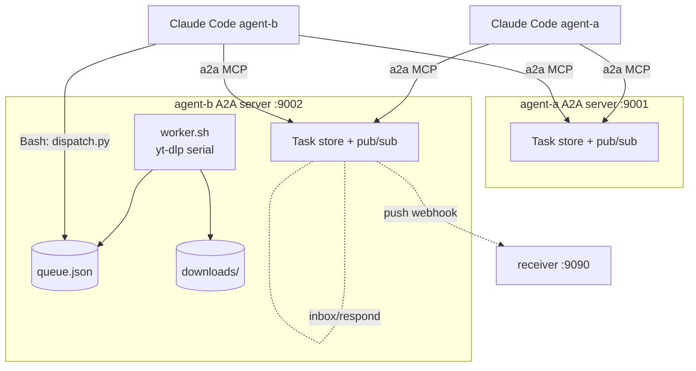

# Demos

Three end-to-end demos drive **two real Claude Code sessions** (`claude -p`) over A2A. They share the same yt-dlp use case but show different parts of the protocol.

| Script | Shows | Network | Quota |
|---|---|---|---|
| `run.sh` | full flow: send + poll, real downloads | yes (yt-dlp hits real URLs) | 2 Claude sessions |
| `run.sh --mock-ytdlp` | same, mock yt-dlp | no | 2 Claude sessions |
| `run-stream.sh` | `message/stream` SSE — agent-a sees task / artifact-update / status-update events live | no (mock) | 2 Claude sessions |
| `run-push.sh` | `pushNotificationConfig/set` — events delivered to a local webhook receiver | no (mock) | 2 Claude sessions |

## Architecture



## `run.sh` — flagship demo

```bash
./demo/run.sh
./demo/run.sh https://samplelib.com/lib/preview/mp4/sample-5s.mp4
./demo/run.sh --rounds 10 URL1 URL2 URL3
./demo/run.sh --mock-ytdlp
```

What happens:
1. Resets state + downloads dir.
2. `make up` — starts both A2A HTTP servers (idempotent: skips if already listening).
3. Starts `worker.sh` in the background. PID written to `agent-b/state/worker.pid`.
4. Spawns **agent-a** as `claude -p` with a prompt: send N download commands then a `status`, polling each task to completion. Same `contextId` keeps them in one conversation.
5. Loops up to `--rounds` times: each iteration spawns **agent-b** as `claude -p` to drain its inbox and `a2a_respond` with the dispatch envelope.
6. Waits for the queue to drain.
7. Prints final queue snapshot + `ls downloads/`.

## `run-stream.sh` — SSE streaming

Agent-a calls `a2a_stream` (instead of `a2a_send` + `a2a_get_task` polling). It receives the SSE event stream live:
- `kind: "task"` (initial submitted state)
- `kind: "artifact-update"` (the dispatch envelope)
- `kind: "status-update"` with `final: true, state: "completed"`

The script greps these out of the agent transcript at the end so you can see what landed.

## `run-push.sh` — push notifications

1. Starts `demo/push_receiver.py` (FastAPI) on :9090.
2. Agent-a sends a download, then `a2a_set_push_config` with `url=http://127.0.0.1:9090/hook` and `token=demo-token`.
3. The peer's TaskStore POSTs every state change to the receiver, including the `X-A2A-Notification-Token` header.
4. The script tails `demo/push.log` so you can read the events received.

## Files written

| Path | What |
|---|---|
| `agent-b/state/queue.json` | current queue |
| `agent-b/state/worker.pid` | running worker PID |
| `agent-b/state/worker.log` | yt-dlp worker output |
| `agent-b/downloads/` | downloaded media |
| `/tmp/a2a-agent-a.log` | agent-a stream-json transcript |
| `/tmp/a2a-agent-b.log` | concatenated agent-b transcripts (one per drain cycle) |
| `/tmp/a2a-stream-{a,b}.log` | streaming demo |
| `/tmp/a2a-push-{a,b}.log` | push demo |
| `demo/push.log` | events captured by the webhook receiver |

## Tearing down

The demo scripts trap EXIT and shut down servers + worker. Manual:
```bash
make worker-down
make down
```

## Notes on dependencies

- `yt-dlp` on `$PATH` (only for the non-mock real download runs).
- `claude` CLI logged in (uses your Claude Code subscription quota; no `ANTHROPIC_API_KEY` needed).
- All demos use `--permission-mode bypassPermissions`. The agents are invoked headlessly; permission prompts would otherwise block. Demo runs locally, no internet-facing surface.

## Customizing

- Format selector: `download <url> format best[height<=240]`.
- Concurrent downloads: change `worker.sh` to fork per job (this PoC is intentionally serial — "downloaded in order").
- Different storage: swap `queue.py` for a SQLite version; `dispatch.py` is the only consumer.
- Different transport: agents don't have to be on loopback — `peer_url` in `.mcp.json` can point anywhere.
